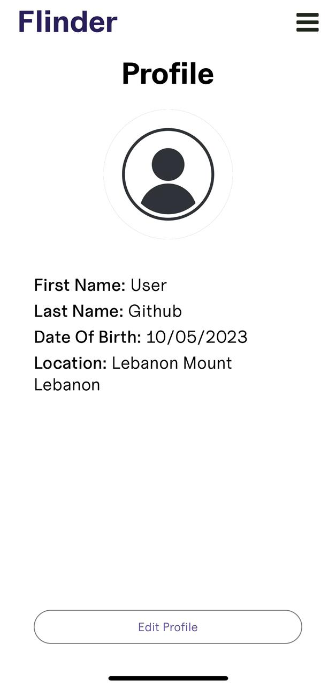
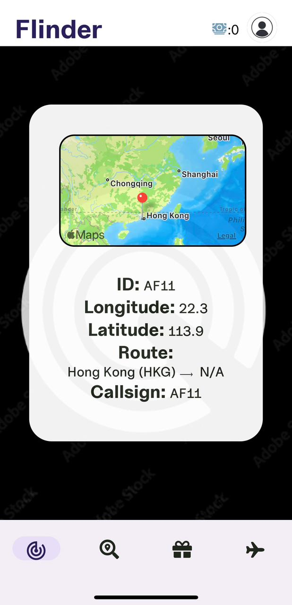
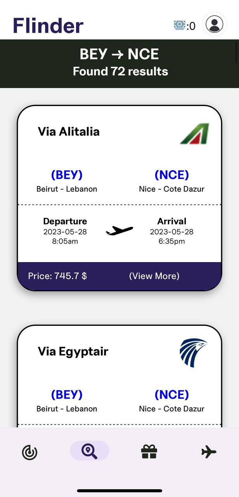
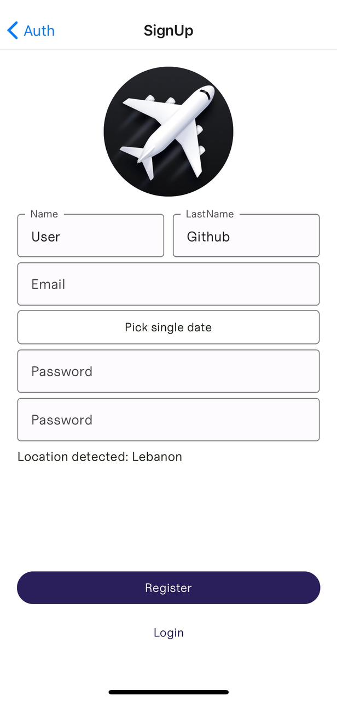
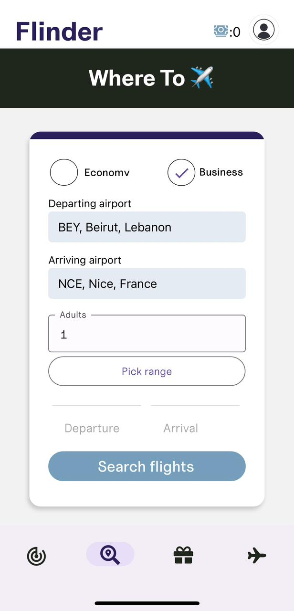

# Flindr (Flight Finder)

Flindr is a React Native application that has been developed using Expo Go and React Native. This sophisticated app was created as the culmination of the Mobile Programming course, serving as our final project. Flindr offers a wide range of features that enable users to seamlessly search for and book flights, utilizing a simulated booking system and rewards program. Additionally, users have the ability to conveniently access their booked flights and monitor planes on a radar screen.

## Screenshots

## Features

- Flight search and booking: Users can search for flights and book them using the app's fake booking system.
- Rewards system: The app includes a rewards system to incentivize users to book more flights.
- View booked flights: Users can view a list of their booked flights and access details about each flight.
- Radar screen: The app provides a radar screen where users can track planes in real-time.

## Technologies Used

- React Native
- Expo Go
- Firebase (as the database)
- API 1: [API name and link]
- API 2: [API name and link]

## Contributors

- 
- 
